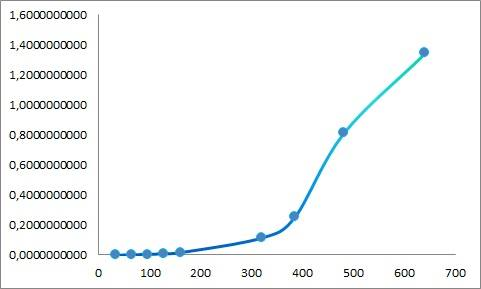
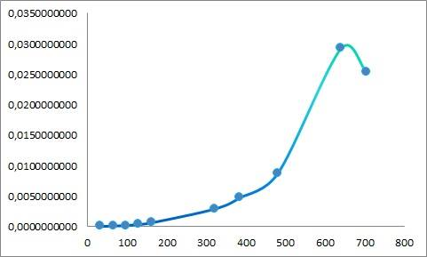
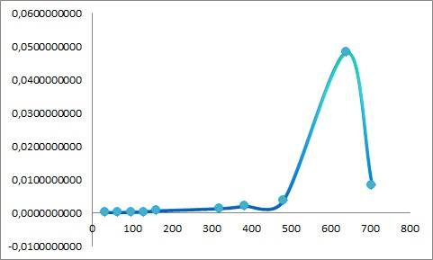

# Comparacion del proceso de multiplicación de matrices, en implementaciones secuenciales (CPU), y paralelas, usando solamente CUDA, y otra usando además SHARED MEMORY

Dada la definición que se tiene de GPU (Graphics Processor Unit), como Unidad de procesamiento gráfico  es un coprocesador dedicado al procesamiento de gráficos u operaciones de coma flotante.

Por tanto, y dado el potencial de procesos que pueden ser ejecutados en la GPU de manera independiente, se presenta la aplicación de diferentes métodos de paralelismo, que pueden ser llevados a cabo sobre un algoritmo fundamental: la multiplicación de matrices.

Este procedimiento es computacionalmente costoso, debido a su complejidad O(A_ROW*A_COL*B_COL), y si es analisado, desde matrices cuadradas, entonces su complejidad es visiblemente cúbica.

Este, entonces es un tratamiento ineficiente del proceso debido a que para grandes cantidades de datos, es decir, posiblemente más de mil datos, un algoritmo implementado desde el contexto secuencial, sería ineficiente.

Dado esto, se pretende aprovechar la naturaleza y el potencial de paralelización que representa este problema, en donde es claro que existen procesos atómicos  que  pueden ser "realizados al tiempo", y que de ninguna manera los resultados obtenidos afectan posteriores resultados, o tienen dependencia de resultados previos.

Por tanto, se procede a implementar los diferentes enfoques del problema, desde el algoritmo secuencial, el paralelo "ingenuo" y el paralelo con shared memory.

Esto, con el fin único y académico de realizar un comparativo, sobre los tiempos de ejecución y encontrar en dichos datos experimentales, la base sólida para un posterior análisis y conclusiones al respecto.

Especificaciones:

- Intel(R) Core(TM) i7-3770K CPU @ 3.50GHz
- DUAL SLI NVIDIA GPU GeForce GTX 780
- 16 GB RAM

**Implementacion secuencial:** Para la implementacion secuencial se utiliza `malloc` y `free`.

**Implementacion CUDA:** La misma gestion de memoria para la implementacion secuencial + `cudaMalloc` y `cudaMemcpy` para manejar la memoria del dispositivo.

**Implementacion CUDA & Shared Memory:** La misma gestion de memoria para la implementacion CUDA + `__shared__` como decorator para declarar la memoria compartida en el device.

## Pruebas

Para las pruebas se utiliza un dataset de matrices cuadradas, con valores aleatorios, con tamaños de 32, 64, 96, 128, 160, 320, 384, 480 ,640 y 704 filas por columnas. Cada prueba fue ejecutada 15 veces para tener una muestra estadistica, que permita resultados fiables para un analisis profundo. Al final se analizarán los tiempos de ejecución y los comparativos entre ellos. 

**Implementacion secuencial:** Ninguna mencion especial.

**Implementacion CUDA:** Se utilizan 32 hilos por bloque bidimiensional para ejecutar el proceso.

**Implementacion CUDA & Shared Memory:** Se utilizan 32 hilos por bloque bidimiensional para ejecutar el proceso. El tamaño de las 2 tiles es de 32*32 posiciones igualmente.

## Resultados

En la siguiente tabla se muestran los promedios para cada una de las 10 pruebas en las 3 implementaciones:

### Secuencial
| BLOCK SIZE | TILE WIDTH | DIMENSION | PRUEBA 1     | PRUEBA 2     | PRUEBA 3     | PRUEBA 4     | PRUEBA 5     | PRUEBA 6     | PRUEBA 7     | PRUEBA 8     | PRUEBA 9     | PRUEBA 10    | PRUEBA 11    | PRUEBA 12    | PRUEBA 13    | PRUEBA 14    | PRUEBA 15    |
|------------|------------|-----------|--------------|--------------|--------------|--------------|--------------|--------------|--------------|--------------|--------------|--------------|--------------|--------------|--------------|--------------|--------------|
| 32         | 32         | 32        | 0,0001500000 | 0,0000960000 | 0,0000960000 | 0,0000980000 | 0,0000960000 | 0,0001010000 | 0,0000970000 | 0,0001000000 | 0,0001480000 | 0,0000980000 | 0,0001510000 | 0,0000970000 | 0,0000960000 | 0,0000950000 | 0,0000980000 |
| 32         | 32         | 64        | 0,0007620000 | 0,0008180000 | 0,0007950000 | 0,0007780000 | 0,0007830000 | 0,0012390000 | 0,0009040000 | 0,0007610000 | 0,0007830000 | 0,0007880000 | 0,0007660000 | 0,0007860000 | 0,0007870000 | 0,0007640000 | 0,0007970000 |
| 32         | 32         | 96        | 0,0025350000 | 0,0025530000 | 0,0041980000 | 0,0043080000 | 0,0025740000 | 0,0025760000 | 0,0025430000 | 0,0025830000 | 0,0024790000 | 0,0025190000 | 0,0025450000 | 0,0041780000 | 0,0042240000 | 0,0025360000 | 0,0025480000 |
| 32         | 32         | 128       | 0,0063340000 | 0,0063860000 | 0,0064220000 | 0,0103350000 | 0,0068290000 | 0,0062320000 | 0,0063600000 | 0,0064660000 | 0,0063950000 | 0,0063840000 | 0,0061930000 | 0,0064000000 | 0,0064030000 | 0,0063570000 | 0,0174000000 |
| 32         | 32         | 160       | 0,0209900000 | 0,0127740000 | 0,0210330000 | 0,0161810000 | 0,0124030000 | 0,0136610000 | 0,0145690000 | 0,0129610000 | 0,0128080000 | 0,0208820000 | 0,0206390000 | 0,0125750000 | 0,0127430000 | 0,0125220000 | 0,0125130000 |
| 32         | 32         | 320       | 0,1171450000 | 0,1167300000 | 0,1127438000 | 0,1139080000 | 0,1098760000 | 0,1128340000 | 0,1087190000 | 0,1100810000 | 0,1119480000 | 0,1129920000 | 0,1105650000 | 0,1125100000 | 0,1192490000 | 0,1153990000 | 0,1198560000 |
| 32         | 32         | 384       | 0,2518660000 | 0,2571370000 | 0,2575280000 | 0,2576690000 | 0,2513280000 | 0,2378760000 | 0,2403600000 | 0,2385580000 | 0,2353260000 | 0,2592860000 | 0,2602880000 | 0,2570130000 | 0,2786520000 | 0,2489340000 | 0,2473170000 |
| 32         | 32         | 480       | 0,8131450000 | 0,6310620000 | 0,5745990000 | 0,6908420000 | 0,6590250000 | 0,4755280000 | 0,6743990000 | 0,6383070000 | 0,5325580000 | 0,6752280000 | 0,5980070000 | 0,7405990000 | 0,6949110000 | 0,6495060000 | 0,7087260000 |
| 32         | 32         | 640       | 1,3495050000 | 1,2859250000 | 1,2880330000 | 1,2913888000 | 1,2933640000 | 1,2886100000 | 1,2800083000 | 1,2805180000 | 1,2834580000 | 1,1867170000 | 1,1790001000 | 1,1847300000 | 1,3055190000 | 1,2781570000 | 1,2804360000 |
| 32         | 32         | 704       | 6,0044090000 | 5,1499700000 | 6,5742620000 | 4,8711560000 | 5,2049360000 | 4,8703930000 | 6,0771920000 | 5,0552820000 | 7,7544550000 | 4,8126700000 | 6,0386350000 | 7,3096240000 | 4,9346710000 | 5,9570700000 | 7,2207870000 |

| DIMENSIONES | PROMEDIO     |
|-------------|--------------|
| 32          | 0,0001078000 |
| 64          | 0,0008207333 |
| 96          | 0,0029932667 |
| 128         | 0,0073930667 |
| 160         | 0,0152836000 |
| 320         | 0,1136370533 |
| 384         | 0,2518660000 |
| 480         | 0,8131450000 |
| 640         | 1,3495050000 |
| 704         | 6,0044090000 |

#### GRAFICA OBTENIDA (DATOS VS TIEMPO DE EJECUCION)

### Paralelismo Ingenuo
| BLOCK SIZE | TILE WIDTH | DIMENSION | PRUEBA 1     | PRUEBA 2     | PRUEBA 3     | PRUEBA 4     | PRUEBA 5     | PRUEBA 6     | PRUEBA 7     | PRUEBA 8     | PRUEBA 9     | PRUEBA 10    | PRUEBA 11    | PRUEBA 12    | PRUEBA 13    | PRUEBA 14    | PRUEBA 15    |
|------------|------------|-----------|--------------|--------------|--------------|--------------|--------------|--------------|--------------|--------------|--------------|--------------|--------------|--------------|--------------|--------------|--------------|
| 32         | 32         | 32        | 0,0001010000 | 0,0001090000 | 0,0001060000 | 0,0001050000 | 0,0001040000 | 0,0001050000 | 0,0001010000 | 0,0001060000 | 0,0001020000 | 0,0001170000 | 0,0001000000 | 0,0001070000 | 0,0001050000 | 0,0001040000 | 0,0000990000 |
| 32         | 32         | 64        | 0,0001560000 | 0,0001590000 | 0,0001620000 | 0,0001660000 | 0,0001650000 | 0,0001690000 | 0,0001900000 | 0,0001840000 | 0,0001550000 | 0,0001610000 | 0,0001530000 | 0,0001670000 | 0,0001770000 | 0,0001570000 | 0,0001510000 |
| 32         | 32         | 96        | 0,0002200000 | 0,0002370000 | 0,0002270000 | 0,0002350000 | 0,0002300000 | 0,0002350000 | 0,0002460000 | 0,0002290000 | 0,0002470000 | 0,0002310000 | 0,0002280000 | 0,0002300000 | 0,0002460000 | 0,0002220000 | 0,0002270000 |
| 32         | 32         | 128       | 0,0004060000 | 0,0004130000 | 0,0004160000 | 0,0004000000 | 0,0004140000 | 0,0004090000 | 0,0004300000 | 0,0004200000 | 0,0004330000 | 0,0003930000 | 0,0004110000 | 0,0004190000 | 0,0004090000 | 0,0004190000 | 0,0004350000 |
| 32         | 32         | 160       | 0,0006800000 | 0,0006470000 | 0,0007090000 | 0,0006850000 | 0,0006480000 | 0,0007120000 | 0,0006810000 | 0,0006850000 | 0,0007080000 | 0,0006510000 | 0,0006870000 | 0,0007130000 | 0,0006500000 | 0,0006470000 | 0,0006670000 |
| 32         | 32         | 320       | 0,0030070000 | 0,0029170000 | 0,0029260000 | 0,0031130000 | 0,0030180000 | 0,0029180000 | 0,0029150000 | 0,0029310000 | 0,0029140000 | 0,0029180000 | 0,0030320000 | 0,0029690000 | 0,0029180000 | 0,0029210000 | 0,0029170000 |
| 32         | 32         | 384       | 0,0047750000 | 0,0047490000 | 0,0047520000 | 0,0048750000 | 0,0047650000 | 0,0047650000 | 0,0047450000 | 0,0049710000 | 0,0049630000 | 0,0047380000 | 0,0047480000 | 0,0047660000 | 0,0047580000 | 0,0047450000 | 0,0047820000 |
| 32         | 32         | 480       | 0,0087320000 | 0,0087530000 | 0,0089110000 | 0,0087310000 | 0,0088880000 | 0,0090600000 | 0,0086080000 | 0,0092240000 | 0,0090560000 | 0,0087390000 | 0,0087390000 | 0,0087410000 | 0,0087660000 | 0,0087160000 | 0,0087260000 |
| 32         | 32         | 640       | 0,0294460000 | 0,0293200000 | 0,0294470000 | 0,0292840000 | 0,0295140000 | 0,0293250000 | 0,0292580000 | 0,0293960000 | 0,0292580000 | 0,0293000000 | 0,0293150000 | 0,0293160000 | 0,0293240000 | 0,0293470000 | 0,0288960000 |
| 32         | 32         | 704       | 0,0253560000 | 0,0253760000 | 0,0258580000 | 0,0253900000 | 0,0250800000 | 0,0256930000 | 0,0257560000 | 0,0257560000 | 0,0251440000 | 0,0251140000 | 0,0254310000 | 0,0256300000 | 0,0232800000 | 0,0260590000 | 0,0251880000 |

| DIMENSIONES | PROMEDIO     |
|-------------|--------------|
| 32          | 0,0001047333 |
| 64          | 0,0001648000 |
| 96          | 0,0002326667 |
| 128         | 0,0004151333 |
| 160         | 0,0006780000 |
| 320         | 0,0029556000 |
| 384         | 0,0047931333 |
| 480         | 0,0088260000 |
| 640         | 0,0293164000 |
| 704         | 0,0253407333 |

#### GRAFICA OBTENIDA (DATOS VS TIEMPO DE EJECUCION)

### Shared Memory

| BLOCK SIZE | TILE WIDTH | DIMENSION | PRUEBA 1     | PRUEBA 2     | PRUEBA 3     | PRUEBA 4     | PRUEBA 5     | PRUEBA 6     | PRUEBA 7     | PRUEBA 8     | PRUEBA 9     | PRUEBA 10    | PRUEBA 11    | PRUEBA 12    | PRUEBA 13    | PRUEBA 14    | PRUEBA 15    |
|------------|------------|-----------|--------------|--------------|--------------|--------------|--------------|--------------|--------------|--------------|--------------|--------------|--------------|--------------|--------------|--------------|--------------|
| 32         | 32         | 32        | 0,0001010000 | 0,0000990000 | 0,0001230000 | 0,0000910000 | 0,0001060000 | 0,0001000000 | 0,0001070000 | 0,0001140000 | 0,0001150000 | 0,0000960000 | 0,0000970000 | 0,0001250000 | 0,0001200000 | 0,0001030000 | 0,0000980000 |
| 32         | 32         | 64        | 0,0001470000 | 0,0001660000 | 0,0001390000 | 0,0001410000 | 0,0001330000 | 0,0001310000 | 0,0001480000 | 0,0001340000 | 0,0001290000 | 0,0001320000 | 0,0001630000 | 0,0001340000 | 0,0001450000 | 0,0001290000 | 0,0001360000 |
| 32         | 32         | 96        | 0,0001850000 | 0,0002210000 | 0,0001930000 | 0,0001890000 | 0,0001790000 | 0,0001820000 | 0,0001920000 | 0,0002170000 | 0,0001890000 | 0,0001780000 | 0,0002140000 | 0,0001720000 | 0,0002160000 | 0,0001870000 | 0,0001850000 |
| 32         | 32         | 128       | 0,0002600000 | 0,0003150000 | 0,0002600000 | 0,0002970000 | 0,0003210000 | 0,0003060000 | 0,0002820000 | 0,0002796000 | 0,0002660000 | 0,0003210000 | 0,0002780000 | 0,0002750000 | 0,0002900000 | 0,0002680000 | 0,0002770000 |
| 32         | 32         | 160       | 0,0004480000 | 0,0003910000 | 0,0039000000 | 0,0003810000 | 0,0003840000 | 0,0003840000 | 0,0003770000 | 0,0003820000 | 0,0003950000 | 0,0004130000 | 0,0004370000 | 0,0003999000 | 0,0003750000 | 0,0003790000 | 0,0003780000 |
| 32         | 32         | 320       | 0,0012555000 | 0,0012600000 | 0,0012520000 | 0,0013280000 | 0,0015130000 | 0,0014600000 | 0,0012740000 | 0,0012550000 | 0,0012510000 | 0,0012650000 | 0,0012560000 | 0,0015160000 | 0,0012560000 | 0,0012580000 | 0,0012530000 |
| 32         | 32         | 384       | 0,0020520000 | 0,0021690000 | 0,0019590000 | 0,0019810000 | 0,0022960000 | 0,0020620000 | 0,0020490000 | 0,0020830000 | 0,0019800000 | 0,0020520000 | 0,0021490000 | 0,0019570000 | 0,0020590000 | 0,0020040000 | 0,0020560000 |
| 32         | 32         | 480       | 0,0036510000 | 0,0038590000 | 0,0034560000 | 0,0035080000 | 0,0034510000 | 0,0034370000 | 0,0034630000 | 0,0039040000 | 0,0038220000 | 0,0035150000 | 0,0036540000 | 0,0034120000 | 0,0038220000 | 0,0037110000 | 0,0035040000 |
| 32         | 32         | 640       | 0,0122930000 | 0,0397090000 | 0,3102700000 | 0,0514000000 | 0,0164810000 | 0,0094540000 | 0,0103570000 | 0,0275510000 | 0,0472240000 | 0,0517150000 | 0,0252920000 | 0,0376310000 | 0,0275410000 | 0,0365020000 | 0,0218030000 |
| 32         | 32         | 704       | 0,0084110000 | 0,0082700000 | 0,0084080000 | 0,0083340000 | 0,0083620000 | 0,0085340000 | 0,0090120000 | 0,0083760000 | 0,0088750000 | 0,0083360000 | 0,0081470000 | 0,0084820000 | 0,0081560000 | 0,0085550000 | 0,0086200000 |
|            |            |           |              |              |              |              |              |              |              |              |              |              |              |              |              |              |              |

| DIMENSIONES | PROMEDIO     |
|-------------|--------------|
| 32          | 0,0001063333 |
| 64          | 0,0001404667 |
| 96          | 0,0001932667 |
| 128         | 0,0002863733 |
| 160         | 0,0006282600 |
| 320         | 0,0013101667 |
| 384         | 0,0020605333 |
| 480         | 0,0036112667 |
| 640         | 0,0483482000 |
| 704         | 0,0084585333 |

#### GRAFICA OBTENIDA (DATOS VS TIEMPO DE EJECUCION)

## Aceleracion Obtenida

### Entre la implementación secuencial y Shared Memory
| DIMENSIONES | ACELERACION(X) |
|-------------|----------------|
| 32          | 1,0137931034   |
| 64          | 5,8429046037   |
| 96          | 15,4877543981  |
| 128         | 25,8161840022  |
| 160         | 24,3268710407  |
| 320         | 86,7348072764  |
| 384         | 122,2334023554 |
| 480         | 225,1689158006 |
| 640         | 27,9122076934  |
| 704         | 709,8640820316 |

### Entre la implementación secuencial y la paralelización ingenua

| DIMENSIONES | ACELERACION(X) |
|-------------|----------------|
| 32          | 1,0292807129   |
| 64          | 4,9801779935   |
| 96          | 12,8650429799  |
| 128         | 17,8088967400  |
| 160         | 22,5421828909  |
| 320         | 38,4480489015  |
| 384         | 52,5472551010  |
| 480         | 92,1306367550  |
| 640         | 46,0324255366  |
| 704         | 236,9469312911 |

## Conclusiones

- Con base a los resultados obtenidos, se puede concluir que, aunque ambos algoritmos paralelos le dan un mayor rendimiento y por ende acelaración al programa, con respecto a su implementación secuencial, en definitiva se observa un comportamiento mucho mejor en la implementación con shared memory.

- El metodo de tiling para el uso de shared memory, resultó ser realmente mucho más apropiado que la paralelización ingenua, sin embargo, ocurrió que los tamaños de las matrices debían ser múltiplos del tamaño del tile.

- Es realmente grandioso, comprender como el cambio de enfoque puede desencadenar, incluso desde el mismo proceso de paralelización, resultados muy diferentes, como fue el caso de shared memory y la paralelización ingenua.

- La multiplicación de matrices es un problema altamente paralelizable, sobre el cual se pueden generar muchos desarrollos y mejoras desde el campo de la computación en paralelo.